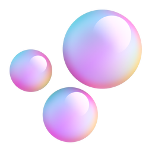

## 안녕하세요! 

프론트엔드 개발자 강채연입니다!

 

## Education & Experience

-  2019-2025 **국민대학교**
  - 임산생명공학과 전공
  - 소프트웨어학부 부전공
-  2022 **멋쟁이 사자처럼 10기**
-  2024 **JECT 1기**

<!--
**rkdcodus/rkdcodus** is a ✨ _special_ ✨ repository because its `README.md` (this file) appears on your GitHub profile.

Here are some ideas to get you started:

- 🔭 I’m currently working on ...
- 🌱 I’m currently learning ...
- 👯 I’m looking to collaborate on ...
- 🤔 I’m looking for help with ...
- 💬 Ask me about ...
- 📫 How to reach me: ...
- 😄 Pronouns: ...
- ⚡ Fun fact: ...
-->

<!--
## Skills 

|                                          #                                           |     skill      |                                Proficiency                                |                                    #                                     |       skill       |                                Proficiency                                |
| :----------------------------------------------------------------------------------: | :------------: | :-----------------------------------------------------------------------: | :----------------------------------------------------------------------: | :---------------: | :-----------------------------------------------------------------------: |
|  |     Python     |  |              |       HTML5       |  |
|                     |   Javascript   |  |               |       CSS3        |  |
|                     |   Typescript   |        |  | styled-components |        |
|                          |     React      |  |             |      stylex       |        |
|                 | Tanstack query |        |            |     three.js      |                         |
|                         |     Django     |        |
|                         |    Next.js     |                         |
|                         |    Node.js     |                         |
-->
